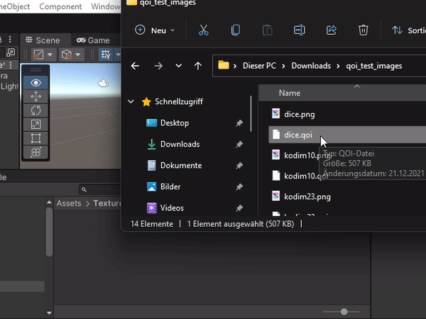
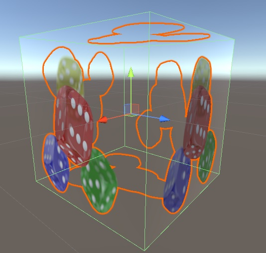
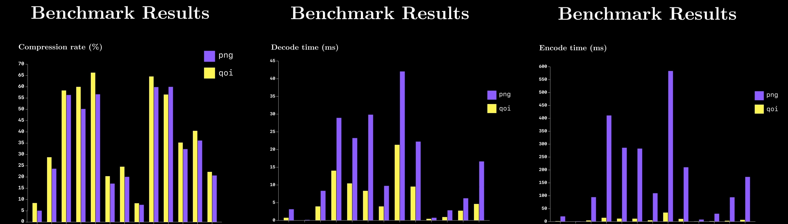

 

# unity-qoi
A simple Unity importer for [qoi, the "Quite OK Image" image format](https://github.com/phoboslab/qoi) for fast, lossless image compression.
This importer utilises the [QoiSharp](https://github.com/NUlliiON/QoiSharp) implementation.

Requires Unity 2021.1.x or newer!
Importing the unitypackage on older versions will cause errors.

Qoi provides on-par compression with PNG, while being way faster at decoding (3x - 4x) and encoding (20x - 50x).
[Benchmarks](https://youtu.be/EFUYNoFRHQI?t=1706) by [Reducible](https://www.youtube.com/c/Reducible)

## Installation
Download the lastest [Release (.unitypackage)](https://github.com/Ben1138/unity-qoi/releases) and drag-drop it into your project.