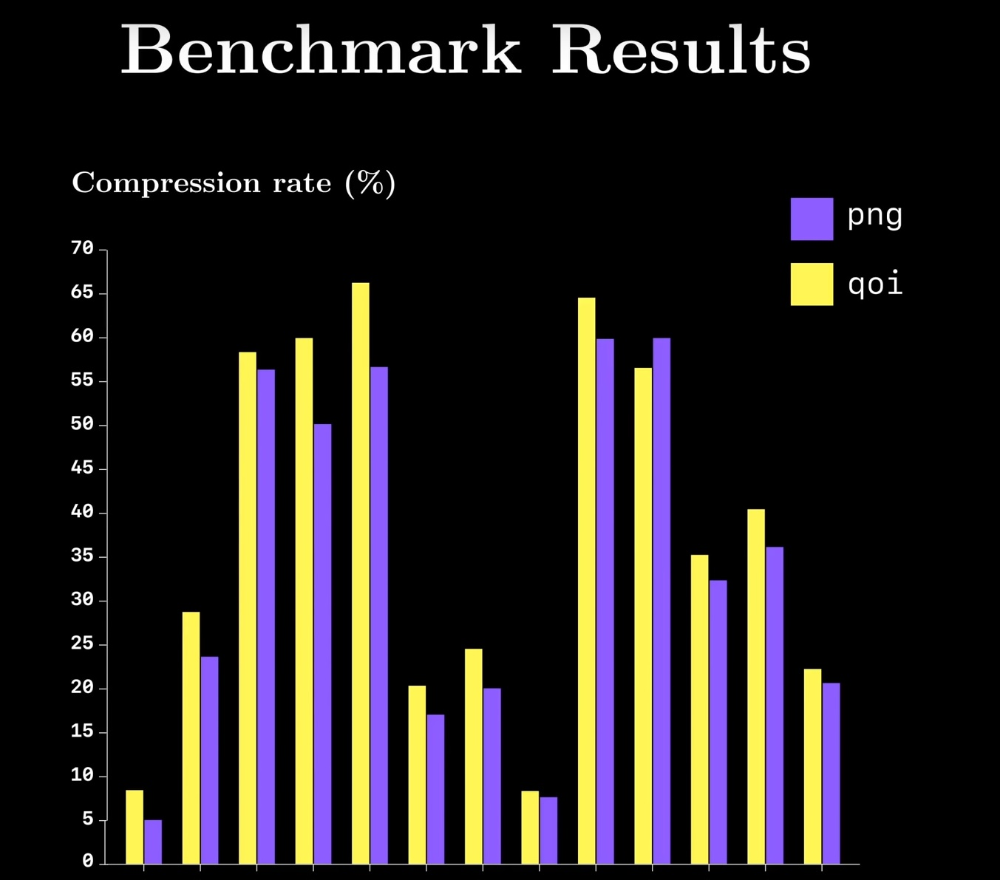
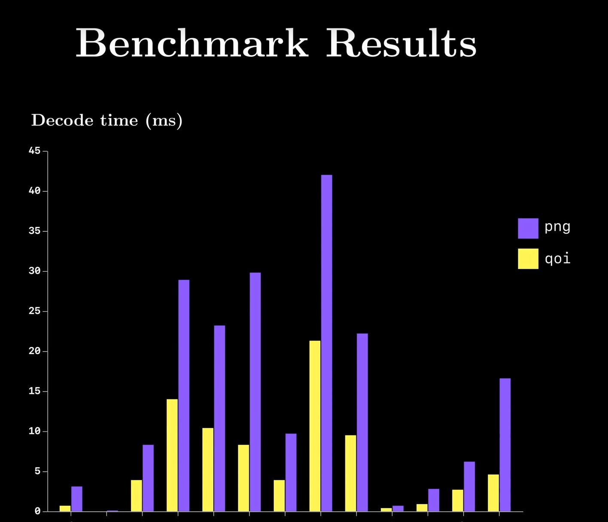
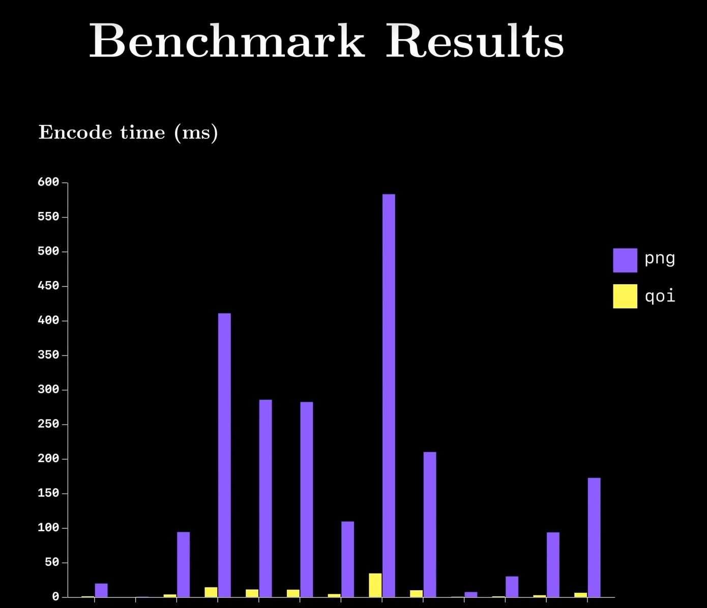

# unity-qoi
A simple Unity importer for [qoi](https://github.com/phoboslab/qoi), the "Quite OK Image" image format for fast, lossless image compression.
This importer utilises the [QoiSharp](https://github.com/NUlliiON/QoiSharp) implementation.

Qoi provides on-par compression with PNG, while being way faster at decoding (3x - 4x) end encoding (20x - 50x).
[Benchmarks](https://youtu.be/EFUYNoFRHQI?t=1706) by [Reducible](https://www.youtube.com/c/Reducible)

